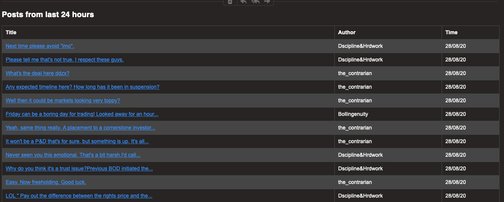

# Hot-Copper-User-Notification-Robot

# What is this for ? 
- Hotcopper is an Australian share trading forum where people share their insights. This robot program can track new posts from given users and send you an email. Example is given below: 

 
# Tech Stack 
- Everything is wirtten in node.js
- Gmail

# Env Set-up 

> INTERVAL=48 // tracking posts from last 48 hours
> 
> URL = https://xxx // target url 
> 
> GMAILUSER=xxx@gmail.com // gmail username 
> 
> GMAILPASS=password // gmail password or application password
> 
> SENDTO=receiver@test.com // receiver address